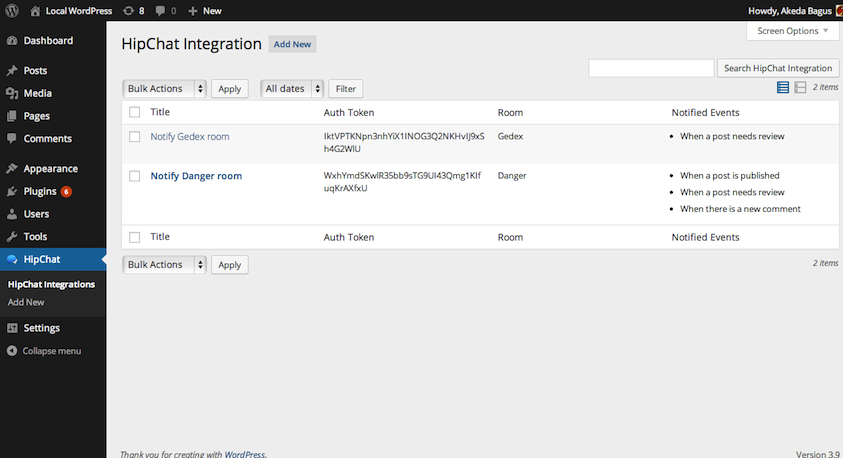
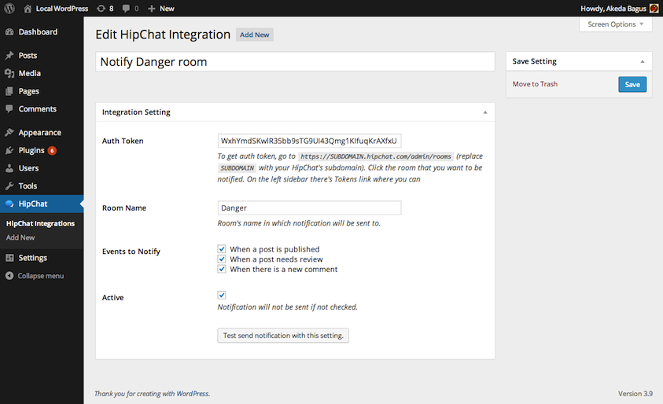
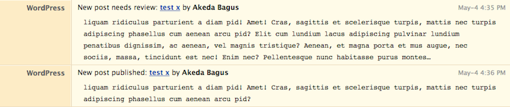

<!-- DO NOT EDIT THIS FILE; it is auto-generated from readme.txt -->
# Better HipChat

Send notifications to HipChat rooms when certain events in WordPress occur.

**Contributors:** [akeda](http://profiles.wordpress.org/akeda)  
**Tags:** [hipchat](http://wordpress.org/plugins/tags/hipchat), [api](http://wordpress.org/plugins/tags/api), [chat](http://wordpress.org/plugins/tags/chat), [notification](http://wordpress.org/plugins/tags/notification), [room](http://wordpress.org/plugins/tags/room)  
**Requires at least:** 3.6  
**Tested up to:** 3.9  
**Stable tag:** trunk (master)  
**License:** [GPLv2 or later](http://www.gnu.org/licenses/gpl-2.0.html)  
**Donate link:** http://goo.gl/DELyuR  

## Description ##

This plugin allows you to send notifications to [HipChat](https://hipchat.com) rooms when certain events in WordPress occur. By default, there are three events that can be sent to HipChat:

1. When a post needs review (status transitioned to 'pending')
1. When a post is published
1. When there's a new comment

It's possible to add more events using `hipchat_get_events` filter.

**Development of this plugin is done on [GitHub](https://github.com/gedex/wp-better-hipchat). Pull requests are always welcome**.

There's a [HipChat plugin](http://wordpress.org/plugins/hipchat/) that's released by HipChat. Unfortunately there's no repository that allows me to make contribution to that plugin. In latest release, v1.2, the official plugin only notifies one room whenever a post is published and uses old REST API. **Better HipChat** plugin is developed to remove the limitations that official plugin has.

## Installation ##

1. Upload **Better HipChat** plugin to your blog's `wp-content/plugins/` directory and activate.
1. Get **Room Notification Token** in your HipChat, the URL is `https://<SUBDOMAIN>.hipchat.com/admin/rooms` (replace `<SUBDOMAIN>` with your HipChat's subdomain). Click the room that you want to be notified. On the left sidebar there's **Tokens** link. Put the label in which it will be used as the name of the notifier. Note the generated token.
1. Go to **Better HipChat** menu in your WordPress to add the integration (make sure you're logged in as an Administrator).

## Screenshots ##

### Integrations list. Yes, you can add more than one integration.

### Edit integration screen.

### Your room get notified when some events occur.

## Changelog ##

### 0.1.0 ###
Initial release

